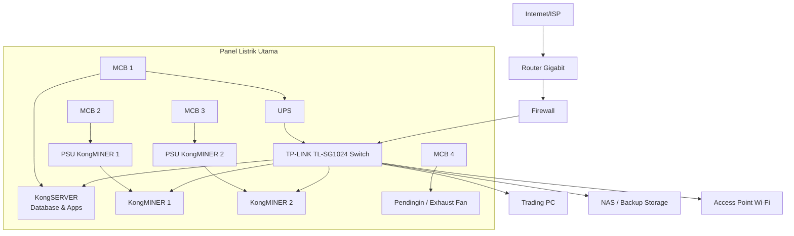

# 🖥️ KongSERVER Network Blueprint


## 📌 Tentang
Blueprint jaringan **KongSERVER** yang menggabungkan:
- **KongSERVER** → Database, aplikasi bisnis, dan pekerjaan harian.
- **KongMINER (Antminer)** → Mining crypto.
- **Trading PC** → Trading cryptocurrency.
- **NAS / Backup Storage** → Penyimpanan terpusat.
- **UPS + Panel Listrik** → Distribusi daya aman & terisolasi.

## 🗺️ Diagram Jaringan


## ⚡ Topologi
```
Internet/ISP
     │
[Router Gigabit]
     │
[Firewall]
     │
[TP-LINK TL-SG1024]
 ├── KongSERVER
 ├── KongMINER 1
 ├── KongMINER 2
 ├── Trading PC
 ├── NAS
 └── Access Point (Wi-Fi)
```

## 🔌 Distribusi Daya
```
[Panel Listrik Utama]
 ├── MCB 1 -> UPS -> Switch + KongSERVER
 ├── MCB 2 -> PSU KongMINER 1
 ├── MCB 3 -> PSU KongMINER 2
 ├── MCB 4 -> Pendingin/Exhaust Fan
```

## 🛡️ Keamanan & Performa
- Kabel **Cat7** S/FTP → kecepatan 10Gbps, minim interferensi.
- IP Static untuk setiap perangkat.
- Pendinginan optimal di ruang server/mining.
- UPS untuk switch & server.
- Firewall memisahkan jaringan mining & database.

---

# 🖥️ KongSERVER Network Blueprint

Diagram ini menggambarkan arsitektur jaringan **KongSERVER** untuk:
- Database & aplikasi bisnis
- Crypto mining dengan Antminer
- Trading workstation
- Sistem penyimpanan & Wi-Fi
- Panel listrik dengan distribusi daya terproteksi



© 2025 KongSERVER Project – MIT License

📞 Contact & Support

Creator

Author: Kongali1720

Email: kongali1720@email.com

GitHub: @kongali1720

Licensing Inquiries

For commercial licensing atau custom development: 📧 Email: kongali1720@email.com

Support

Create an issue for bugs atau questions

Join discussions in Issues tab

Star ⭐ this repo if helpful!

🙏 Acknowledgments

Special thanks to:
Aave Protocol team for excellent documentation
Hardhat team for development tools
OpenZeppelin for security standards
Ethereum community for continuous innovation

⭐ Star This Repository

If this tutorial helped you learn Flash Loans, please consider starring this repository!

© 2025 Kongali1720. All Rights Reserved.

---

⭐️ Feel free to star this repository if you find it useful.


<div align="center">
  
## ❤️ Special Thanks

Made with 🔥 by KONGALI1720 Cyber Force.  

“Scan like a ghost, strike like a hammer.”  

</div>

---

<div align="center">
  
## ✅ Gaspol coding squad Indonesia! 🚀💻

 Halo, Sobat Koding!  
 Hey, Coding Friends!

 Kumpulan mini project Python yang gak bikin ngantuk!  
 Collection of Python mini projects that won’t bore you!

 Belajar sambil praktek langsung, cocok buat yang suka action daripada teori.  
 Learn by doing, perfect for those who prefer action over theory.

Langsung eksekusi, langsung paham.  
Run it directly, understand instantly.

</div>

---

<h3 align="center">💡 ☕ Traktir Kopi & Nasi Padang ama nasi Gorengnya ya cuy! 😄</h3>

<div align="center">

## Dukung terus biar semangat bikin karya edukatif lainnya...  
## Keep supporting so I stay motivated to create more educational works...

# 💡 ☕  [Buy Me a Coffee via PayPal](https://www.paypal.com/paypalme/bungtempong99)  

Support with ☕ so I can buy 🍜 and keep being 🧠!

---

<h2>📫 Let’s Connect Like Hackers</h2>

| Platform | Detail |
|:--------|:-------|
| GitHub  | [kongali1720](https://github.com/kongali1720) |
| Email   | [kongali1720@gmail.com](mailto:kongali1720@gmail.com) |
| Site    | [Coming soon — stay curious... ](https://kongali1720.github.io) |

---

## ❤️  💻 INITIATING HUMANITY MODE... for Down Syndrome ❤️

| Item        | Keterangan / Description |
|:------------|:-------------------------|
| 🎯 Target   | Anak-anak Pejuang Down Syndrome / Kids with Down Syndrome |
| 📡 Status   | Butuh Dukungan / Needs Support |
| 🧠 Response | Buka Hati + Klik Link = Satu Senyum Baru / Open Heart + Click Link = One New Smile |

Mereka bukan berbeda — mereka dilahirkan untuk mengajarkan dunia tentang cinta yang murni dan kesabaran yang luar biasa.  
They are not different — they were born to teach the world pure love and extraordinary patience.

<p align="center" style="font-size: 1.5rem;">
  <a href="https://mydonation4ds.github.io/" target="_blank" style="display: inline-block;">
    
  </a>
</p>

</div>


---

<section align="center" style="font-family: Arial, sans-serif;">

<h2 style="margin-bottom: 20px; color: #0070f3;">💳 Dukungan Pembayaran DONASINYA</h2>

<table align="center" aria-label="Metode Pembayaran" style="margin: 0 auto; border-collapse: collapse; box-shadow: 0 4px 10px rgba(0,0,0,0.1); border-radius: 8px; overflow: hidden;">
  <thead style="background-color: #0070f3; color: white;">
    <tr>
      <th style="padding: 12px 25px; font-size: 18px;">Visa</th>
      <th style="padding: 12px 25px; font-size: 18px;">Mastercard</th>
      <th style="padding: 12px 25px; font-size: 18px;">PayPal</th>
    </tr>
  </thead>
  <tbody style="background-color: #f9f9f9;">
    <tr>
      <td style="padding: 15px;">
        
      </td>
      <td style="padding: 15px;">
        
      </td>
      <td style="padding: 15px;">
        
      </td>
    </tr>
  </tbody>
</table>

</section>


---

<p align="center">
  Kalau project ini bantu kamu, jangan lupa kasih bintang ⭐ dan share ke temen-temen ya!<br>
  Follow <a href="https://twitter.com/kongali1720" target="_blank" rel="noopener noreferrer">@kongali1720</a> buat diskusi dan update seru lainnya 🔥
</p>

<p align="center" style="margin-top: 20px;">
  <a href="https://twitter.com/kongali1720" target="_blank" rel="noopener noreferrer" aria-label="Follow kongali1720 on Twitter">
    
  </a>
</p>

</div>
<div align="center">

---

Built with ❤️ for the Ethereum community

